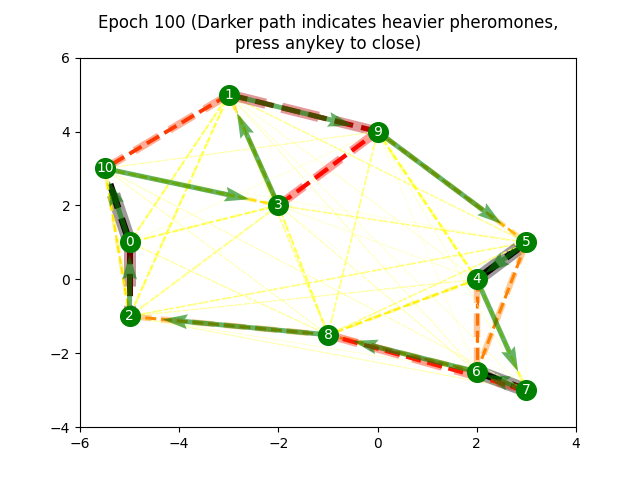

# PSO, ACO Implementation

This repository implements Particle Swarm Optimization, Ant Colony Optimization
from scratch using Python. 
User may choose several objective function to minimize, or use customized function in PSO. 
User may choose number of ants and other paramaters in ACO.

## Particle Swarm Optimization
This program uses matplotlib to animate the particle movements together with their magnitude of velocity. 
Trajectories of previous global best points are shown on the plot to signify improvements.
Run the code below to view animation
```
python swarm_scratch.py
```


## Ant Colony Optimization
This program uses ACO to tackle Travelling Salesman Problem. 
User may customize the nodes on the map, where the distance is L2 norm on the map. 
Number of ants and any other hyperparameters can also be specified. 
```
python ant_scratch.py
```

